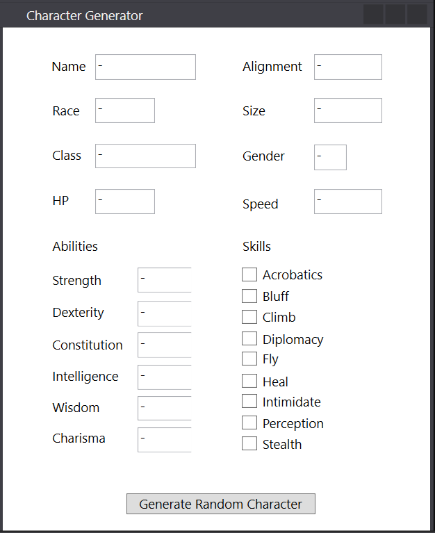

# character-generator
Randomly generates a simple character for Pathfinder

## Creation steps ###
1. Class is selected
2. HitPoints and Skills are set
3. Race is selected
4. Size and abilities are set

Depending on the class that is selected, abilities are prioritized over others for higher scores

